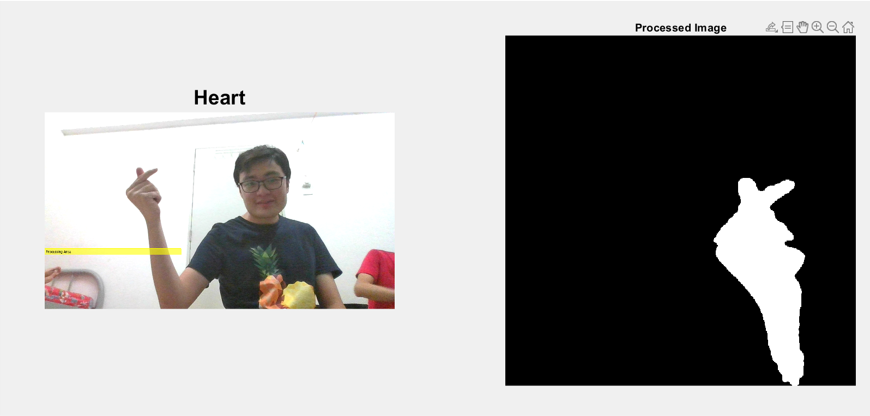
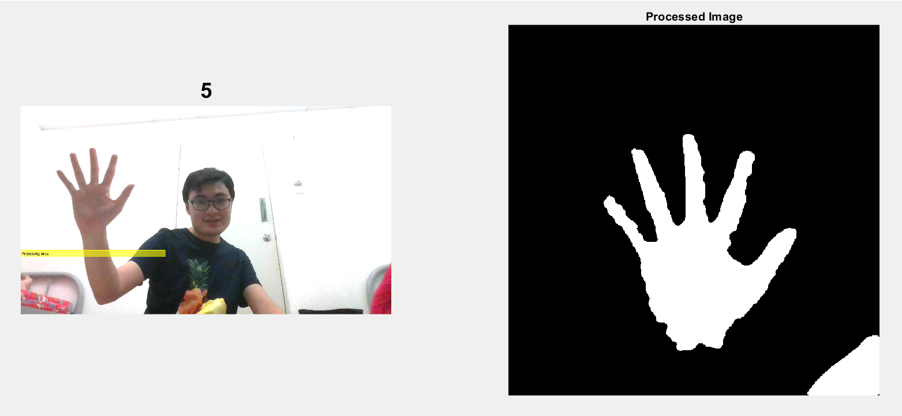
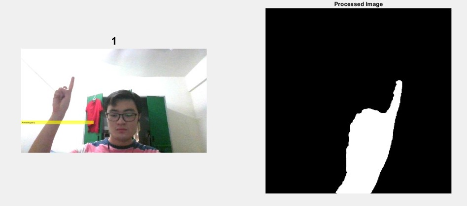

# Hand Gesture Recognition in Matlab
This project is developed using Matlab for the final project of subject BITI3313 Image Processing and Pattern Recognition. This project use transfer learning technique using the AlexNet models and image processing technique.

# Results

